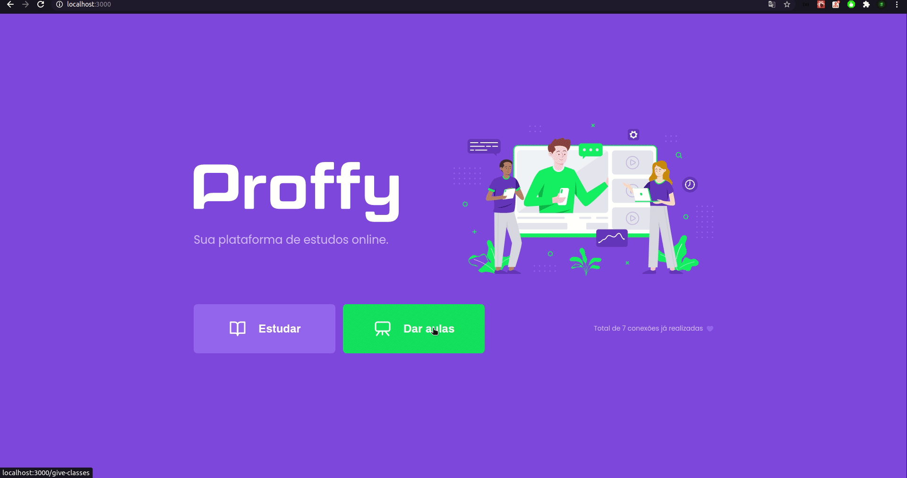
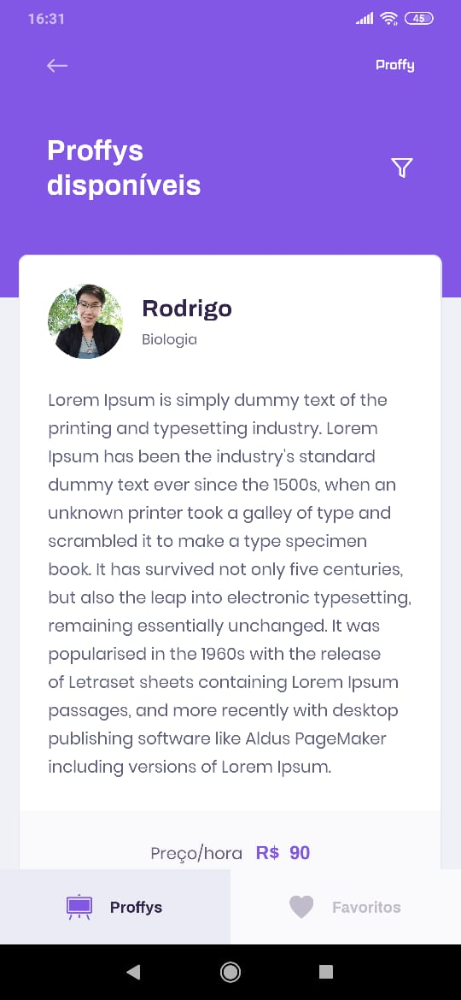

<h1 align="center">
	
</h1>

<h3 align="center">Proffy - aplicação que tem como objetivo conectar alunos e professores.</h3>

<p align="center">
  
</p>

<p align="center">
  

  

  
</p>

## 🛠 Tecnologias

As seguintes ferramentas foram usadas na construção do projeto:

- [Expo](https://expo.io/)
- [Node.js](https://nodejs.org/en/)
- [React](https://pt-br.reactjs.org/)
- [React Native](https://reactnative.dev/)
- [TypeScript](https://www.typescriptlang.org/)

## Pré-requisitos

Antes de começar, você vai precisar ter instalado em sua máquina as seguintes ferramentas:
[Git](https://git-scm.com), [Node.js](https://nodejs.org/en/), [Expo](https://expo.io/), [Yarn](https://classic.yarnpkg.com/lang/en/). 
Além disto é bom ter um editor para trabalhar com o código como [VSCode](https://code.visualstudio.com/)

## 💾 Instalação

### Backend
```bash
	# Clone este repositório
	$ git clone https://github.com/rodrigosakamoto/proffy.git

	# Acesse a pasta do projeto no terminal/cmd
	$ cd proffy

	# Vá para a pasta backend
	$ cd backend

	# Instale as dependências
	$ yarn 

	# Execute o comando para rodar as migrations e criar o banco de dados 
	$ yarn knex:migrate

	# Execute a aplicação em modo de desenvolvimento
	$ yarn dev:server
```

### Frontend
```bash
	# Acesse a pasta do projeto no terminal/cmd
	$ cd proffy

	# Vá para a pasta web
	$ cd web

	# Instale as dependências
	$ yarn

	# Execute a aplicação
	$ yarn start
```

### Mobile
```bash
	# Acesse a pasta do projeto no terminal/cmd
	$ cd proffy

	# Vá para a pasta web
	$ cd mobile

	# Instale as dependências
	$ yarn

	# Execute a aplicação
	$ yarn start
```

---
By Rodrigo Sakamoto

[](https://www.linkedin.com/in/rodrigo-sakamoto/) 
[](mailto:rodosakamoto@gmail.com)

